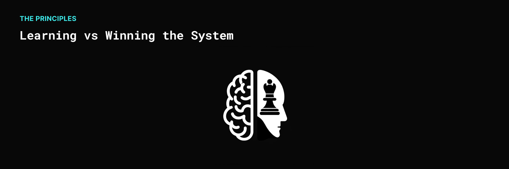

**🤔 Are you really Learning or just Winning the System?**

In the contemporary educational and professional landscape, the principle of "Learning vs Winning the System" has emerged as a crucial concept. This principle delves into the often conflicting approaches towards acquiring knowledge and achieving success, where 'learning' embodies a genuine understanding and mastery of subjects, and 'winning the system' represents a strategic, often superficial pursuit of success.

## Why is this important?

- **Understanding vs. Achieving**: At the heart of this principle is the dichotomy between truly understanding a subject and merely achieving a goal. Genuine learning focuses on the depth of knowledge and skills, fostering critical thinking and problem-solving abilities. In contrast, winning the system often involves using shortcuts and strategies to achieve goals, such as grades or accolades, without a deep understanding.
- **Long-Term Benefits vs. Short-Term Gains**: Genuine learning offers long-term benefits, equipping individuals with the skills and knowledge that last a lifetime. Winning the system, however, typically yields short-term gains that may not translate into long-term success or fulfillment.
- **Intrinsic Motivation vs. Extrinsic Rewards**: Learning is often driven by intrinsic motivation – a genuine interest and passion for the subject. Winning the system, on the other hand, is usually motivated by extrinsic rewards, like grades, titles, or recognition.

### Conclusion

The principle of "**Learning vs Winning the System**" is more than just a concept; it's a guide for lifelong learning and sustainable success. By prioritizing genuine understanding over superficial achievement, we can cultivate a more knowledgeable, skillful, and fulfilled society. The choice between learning and winning the system is not just a decision of methodology but a reflection of our values and vision for the future.

## References

- [The lesson to unlearn: Do you learn to win, or win to learn?](https://paulgraham.com/lesson.html)

#mindset #learning #growth
