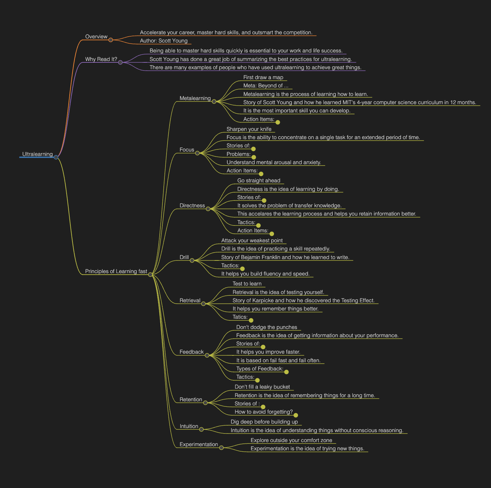

# How to Master Any Skill with Ultralearning: A Guide for the Ambitious

Ever felt like there’s just too much to learn and too little time? Yeah, me too. That’s until I stumbled upon the game-changing approach of **Ultralearning**, a strategy that turbocharges your ability to acquire new skills and knowledge. Thanks to **Scott Young**, the brain behind this brilliant concept, we've got a roadmap to accelerating our learning process and staying ahead in this fast-paced world. Let's dive into what Ultralearning is and how it can transform your approach to learning.

## What is Ultralearning?

In essence, Ultralearning is all about pushing yourself to learn more efficiently and effectively, cutting down the time it takes to master hard skills. Scott Young, who impressively conquered MIT's 4-year computer science curriculum in just 12 months, shares this powerful strategy. It’s not just about working harder, but smarter, and making sure you outsmart the competition while you're at it.

## Why Bother with Ultralearning?

Imagine being able to pick up a new language, master a musical instrument, or switch careers by rapidly acquiring a new skill set. That’s the promise of Ultralearning. It’s for those of us who want to thrive in our careers, hobbies, and personal growth. If you’re all about achieving extraordinary feats or just want to learn that one skill you’ve always dreamed about, Ultralearning is your ticket.

## The Core Principles of Ultralearning

### Metalearning: The Blueprint of Learning

Before you dive into the deep end, you need a plan. Metalearning is about understanding how learning works and then mapping out your path. Think of it as creating a blueprint of what you need to learn, breaking it down into manageable chunks, and figuring out the best resources and strategies to tackle them. Spend 10% of your time planning and the rest doing.

### Focus: The Art of Undivided Attention

In a world brimming with distractions, the ability to focus is a superpower. It’s not just about starting; it’s about maintaining intense concentration throughout your learning sessions. Techniques like the Pomodoro Technique can help you keep your focus sharp and your mind on the prize.

### Directness: Learn by Doing

Ever heard of the saying, "Practice makes perfect"? That’s the essence of directness. It’s about applying what you learn directly through projects or immersive experiences. This hands-on approach not only accelerates your learning but also makes it stick.

### The Power of Drilling and Retrieval

Got a weak spot? Drill it. Want to make sure you remember? Test yourself. These principles are all about targeted practice and self-testing to reinforce your learning and boost retention.

### Feedback and Retention: Fine-Tuning Your Skills

Feedback is the breakfast of champions, and in Ultralearning, it’s what helps you adjust and improve. Pair that with strategies for retention like spaced repetition and mnemonics, and you’re on your way to ensuring that what you learn stays with you.

### Experimentation: The Learning Lab

Lastly, don’t be afraid to experiment. Step out of your comfort zone, try new methods, and find what works best for you. It’s all about the learning journey and discovering the most effective strategies for your unique style.

### Conclusions

Ultralearning isn’t just a method; it’s a mindset. It’s about embracing the challenge of learning and seeing it as an exciting adventure. Whether you’re aiming for a personal breakthrough or looking to upskill for your career, Ultralearning offers a concrete plan to help you achieve your goals faster and more efficiently. So, what’s the first skill you’re going to tackle with Ultralearning? Let’s embark on this journey together and transform the way we learn, one skill at a time.
